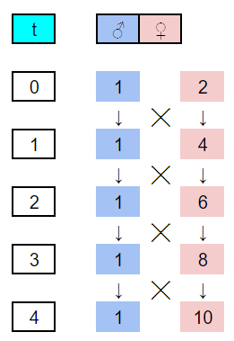
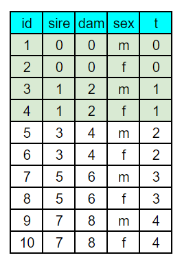

# Systems of close inbreeding

```{r c05_r3_setup, include=FALSE,warning=FALSE,message=FALSE,error=FALSE}
knitr::opts_chunk$set(echo = TRUE)

library(flextable)
library(googlesheets4)
library(kinship2)
library(knitr)
library(tidyverse)

```

## Introduction
Systems of close inbreeding were devised to increase the overall homozygocity of individuals over successive generations. Falconer & Mackay describe several of the most common form of close inbreeding and present recurrence equations for determining the level of inbreeding as a function of generation from the base population. Here, we create a "proof" of the recurrence equations by also determining the accumulation of inbreeding through coancestry. Full sib matings are used as an example here such that you can explore other systems of close inbreeding on your own time.

## Through the recurrence equation
The reccurence equation for full sib mating (5.9) is:
$$
F_t=\frac{1}{4}(1+2F_{t-1}+F_{t-2})
$$
The following script employs a *for loop* to walk forward through 20 generations of full sib mating. A data frame with columns for *generation (t)* and *inbreeding (Fx)* is first defined to store the results of the *for loop*. Starting at generation 1 (*i*=2) and working toward generation 20 (*i*=21), *t* and *Fx* are applied to the recurrence equation. A plot of accumulated inbreeding as a function of generation is then produced for reference. The first few lines of the data frame are also shown for comparison with Table 5.1 in the text.

```{r c05_r3_reccurrence, fig.height=3, fig.width=6}

df <- data.frame(t = 0:20, Fx = 0)

for(i in 2:21){
  ifelse(df$t[i] == 1,
         df$Fx[i] <- 1/4*(1 + 2*df$Fx[i-1]),
         df$Fx[i] <- 1/4*(1 + 2*df$Fx[i-1] + df$Fx[i-2]))
}

df %>%
  ggplot() +
  geom_line(aes(x = t, y = Fx),
            color = "navy", linetype = "dotted", linewidth = 0.5) +
  geom_point(aes(x = t, y = Fx),
             color = "navy", shape = 1, size = 2.5, stroke = 1) +
  scale_x_continuous(breaks = seq(0, 20, by = 1)) +
  scale_y_continuous(breaks = seq(0, 1, by = 0.1)) +
  xlab("generations") +
  ylab("inbreeding (F)") +
  theme_bw()

```

```{r c05_r2_recurrence_df, echo=FALSE}

df %>%
  head(., 10) %>%
  flextable() %>%
  fontsize(size = 10, part = 'all') %>%
  align(align = 'center', part = 'all') %>%
  width(., width = 0.5)

```

## Through coancestry
In the last exercise we learned how to make a kinship matrix. We can now apply that exercise to the calculation of inbreeding (F) over repeated generations of full sib mating. 

### Develop a pedigree and kinship matrix
We need to first develop a pedigree file describing the full sib mating system. While this can be done in R, I often find this easier to do in a spreadsheet program like Google sheets. Using Figure 5.5 from the text, I drew up the first few generations of full sib mating using numerically ascending identification numbers. From the sketch, a sheet with columns for *id*, *sire*, *dam*, *sex*, and *generation*. A *generation* column is not needed for `kinship2` but is handy in both setting up the pedigree and graphing the computed inbreeding later on. Coding the pedigree is performed by starting with individual 1 and entering the identification numbers of their male (sire) and female (dam) parents, and their sex. For individual in the base population, parental values of 0 are entered. The first few generations of the sketched and coded pedigree are shown below. With the first 2x generations coded, recursive equations were written in sheets to extend the pedigree to 21 generations.  

```{r c05_r3_fig_01, echo = FALSE, out.width = '25%'}




```

With the pedigree file made in sheets, the `googlesheets4` package was used to read the file and convert it to a data frame. This is actually a very handy function for working between spreadsheets and R. In fact, the spreadsheet almost acts as a simple general user interface (GUI) for entering data into R. Note, however, that the data doesn't automatically update, but will need to be re-read through R. The only challenges one might encounter in using the `googlesheets4` package have to do with security tokens. If you have any problems, check [Stack Overflow](https://stackoverflow.com/questions/tagged/googlesheets4) for resolutions. Once the pedigree file is in R, its applied to the `pedigree` function from the `kinship2` package for formatting.

```{r c05_r3_pedigree, include=FALSE,warning=FALSE,message=FALSE,error=FALSE}

www <- "https://docs.google.com/spreadsheets/d/1iBIronXZIxMP8GMu5wYj1fANTbhadkRn_eAPZLTo8qE/edit#gid=3080351"

ped_df <- read_sheet(www, sheet = "4") %>%
  data.frame(.)

ped_ks <- pedigree(id = ped_df$id,
                   dadid = ped_df$sire,
                   momid = ped_df$dam,
                   sex = ped_df$sex,
                   missid = 0)

```

The `kinship2` package also includes pedigree plotting features. the following script trims the pedigree to three generations before subjecting it to the `plot.pedigree` function. The resulting pedigree displays the mating scheme with males as squares and females as circles. Large pedigrees can quickly become overwhelming but its a nice feature for illustrating specific mating systems such as those classified as close inbreeding.

```{r c05_r3_ped_plot, fig.height=3, fig.width=3}
ped_trim <- ped_df %>%
  filter(t < 3)

ped_trim <- pedigree(id = ped_trim$id,
                   dadid = ped_trim$sire,
                   momid = ped_trim$dam,
                   sex = ped_trim$sex,
                   missid = 0)

plot.pedigree(ped_trim,
              packed = FALSE,
              align = TRUE,
              cex = 0.75)

```

The `kinship` function is used to develop a kinship matrix. A kinship matrix has same row x column dimensions as the number of individuals in the pedigree. Like pedigrees, they can also quickly become overwhelming. The first 10 rows and columns of our full sib kinship matrix is shown below for reference. It's important to remember that each value of the matrix not only corresponds to the coancestry (*f*) between the parents indicated by the row & column numbers, but also to the coefficient of inbreeding (F) of their offspring.  

```{r c05_r3_kinship}

kinship(ped_ks)[1:10,1:10]

```

### Merge the pedigree and kinship matrix
If the kinship matrix is converted to a data frame, it can then be converted to a 3-column long format data frame with columns for *id*, *sire*, and *dam*. If this data frame is then merged to the original pedigree file using `right_join` and by *sire* and *dam*, a column equating to the coancestry (f) of the sire-dam combination is added. By definition, this column also equates to the inbreeding coefficient (F) of the individual.

The following code completed this operation and then goes a step further for the exercise at hand. First, the generation number (*t*) is reduced by 1 since *F* rather than *f* is being considered. Second, the average inbreeding coefficient per generation is calculated. These two changes permit direct comparison for the recurrence equation.

```{r c05_r3_merge}

df_coa <- data.frame(kinship(ped_ks)) %>%
  set_names(., nm = ped_df$id) %>%
  mutate(sire = 1:length(ped_df$id)) %>%
  gather(key = "dam", value = "f", - c(sire)) %>%
  mutate(sire = as.numeric(sire),
         dam = as.numeric(dam)) %>%
  right_join(., ped_df, by = c("sire", "dam")) %>%
  select(t, id, sire, dam, f) %>%
  arrange(id) %>%
  mutate(t = as.numeric(t) - 1) %>% # this converts f to F
  group_by(t) %>%
  summarize(Ft = mean(f)) %>%
  na.omit()

```

### Compare with the recurrence equation
An overlay plot of the recurrence equation on coancestry is shown below. The two methods produce the same result without any error. Full sib inbreeding is straight forward in that there are no alternative mating designs. This is also the case for the offspring-parent and repeated backcross systems. Half sib mating is more complex in that a number of mating designs employing 3-4 parents result in half-sibs but also result in ancillary full sibs. As such, identifying the mating design that best corresponds to the recurrence equation might take some experimentation.  

``` {r c05_r3_graph, fig.height=3, fig.width=6}

df_coa %>%
  merge(., df, by = "t") %>%
  gather(key = "method", value = "value", -t) %>%
  mutate(method = case_when(method == "Ft" ~ "coancestry",
                            method == "Fx" ~ "recurrence")) %>%
  ggplot() +
  geom_line(aes(x = t, y = value, group = method, color = method),
            linetype = "dotted", linewidth = 0.5) +
  geom_point(aes(x = t, y = value, shape = method, color = method),
             size = 2.5, stroke = 1) +
  scale_shape_manual(values = c(1,4)) +
  scale_color_manual(values = c("lightblue", "navy")) +
  scale_x_continuous(breaks = seq(0, 20, by = 1)) +
  scale_y_continuous(breaks = seq(0, 1, by = 0.1)) +
  xlab("generations") +
  ylab("inbreeding (F)") +
  theme_bw()

```

## Conclusion
With only minor changes, the scripts can be applied to the other systems of close inbreeding in the text with the exception of self-fertilization, which seemingly can't be handled in `kinship2`. Performing this on your own time will help you better understand the relationship between pedigree illustrations and pedigree files. It will also reinforce the relationship between the coancestry of parents and the inbreeding coefficient of offspring, and provide a method for calculating generational inbreeding from individual coefficients. 

