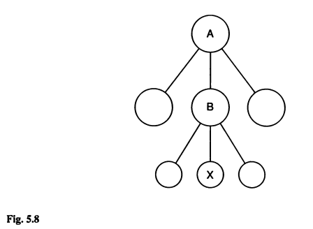

# Change of base

```{r C05_R3_setup, include=FALSE}
library(knitr)
opts_chunk$set(echo = TRUE)

```

## Introduction

This exercise follows directly on with example 5.2. The problem pertains to changing the base population to which a specific generation of individuals is referenced. Figure 5.8 is presented below. Briefly, the inbreeding of population X was initially determined in reference to population B. However, by knowing the inbreeding of population B relative to A, we can change the base of population X from B to A.

```{r C05_R3_fig_01, echo = FALSE, out.width = '50%'}



```

Th example problem is relatively straightforward. Here, we perform a proof of the underlying principles by performing a simulation using `AlphaSimR`. The proof involves first performing a simulation covering populations A-to-X. Next, the accumulation of inbreeding for A-to-B and B-to-X are assessed separately. The change of base if then determined mathematically using equation 5.17. Finally, inbreeding accumulation from A-to-X will be examined to check the results of changing base populations. 

This exercise requires both the `kinship2` and `AlphaSimR` packages. `tidyverse` tools are used for general data wrangling and presentation.

```{r C05_R3_libraries, warning=FALSE, message=FALSE, error=FALSE}

library(AlphaSimR)
library(flextable)
library(kinship2)
library(tidyverse)

```

## Development of the base population

To start the simulation a base population needs to be developed. Of all the simulations performed in the manual, this one probably has the least important base population. the reason being that all downstream calculations are based on the pedigree itself, rather than anything related to gene frequencies. As such, a single chromosome with 10 segregation sites produced using `quickhaplo` will produce the same results as an *in silico* copy of the mouse genome with ten thousand generations of burn-in. Example 5.2 specifies 42 generations of breeding at an effective population size of 40 (NB: from A-to-B), followed by a further 11 generations of full-sib mating (NB: from B-to-X).

Any number of mating schemes could be used to go from A-to-B but the minimal inbreeding strategy common to laboratory animal, and describe in Chapter 4, is the easiest to envision. For minimal inbreeding *N_e = 2N-1*. As such, a base population with 20 individuals provides an *N_e* of just about 40. Sexes are specified to make the simulation easily compatible with the `kinship2` package. The following code develops base population A.

```{r C05_R3_basepop}

n_pop <- 20

pop_haps <- quickHaplo(nInd = n_pop,      
                       nChr = 1,      
                       segSites = 10,
                       genLen = 1,  
                       ploidy = 2L,   
                       inbred = FALSE)

SP = SimParam$new(pop_haps)
SP$setSexes("yes_sys")

pop_0 <- newPop(rawPop = pop_haps,
                simParam = SP)
```

## Breed from A-to-B & from B-to-X

Prior to breeding, a vector list was developed to hold the populations created by a for loop and the base population stored. The first loop employs the `randCross` function to perform 10 crosses each producing 2 progeny. In this way, the individuals of each generation are replaced by their offspring and an *N_e* of near 40 is maintained.

Full-sib mating commences at generation 42. The function `makeCross` is used to perform the full-sib mating according to the previously defined cross plan. In this case, the cross plan takes advantage of the sequential and predictable enumeration of individuals in `AlphaSimR`. For each generation, individual IDs are used to fill a 2-column matrix row-wise. In this way, the matrix is composed of rows of brother-sister combinations. We only need to switch the column order to sister-brother to conform with the cross plan structure. With the logical organization of `AlphaSimR`, repeating the cross plan over a series of generations results in 10 separate full-sib lines.

```{r C05_R3_breed}

POP <- vector(length = 55, mode = "list")

POP[[1]] <- pop_0

for(i in 2:43){
  POP[[i]] <- randCross(pop = POP[[i - 1]],
                        nCrosses = 10,
                        nProgeny = 2,
                        simParam = SP)
}

for(i in 44:55){

  cp <- matrix(data = POP[[i-1]]@id,
        ncol = 2,
        byrow = TRUE)
  
  cp <- cbind(cp[,2], cp[,1])
  
  POP[[i]] <- makeCross(pop = POP[[i-1]],
                        crossPlan = cp,
                        nProgeny = 2,
                        simParam = SP)
}

```

## Get the complete A-to-X pedigree

A function was first developed to pull and format the pedigree as a data frame from a single population. The `do.call` and `lapply` functions were then used to pull and combine the pedigrees from all populations. The first and last 5 entries in the pedigree are shown for interest. Note that both *sex* and *generation (t)* were added to the pedigree. While *sex* permits easy integration with `kinship2`, generation facilitates data wrangling and presentation later on. 

```{r C05_R3_ped}

full_ped <- function(gen){
  getPed(POP[[gen]]) %>%
    mutate(t = gen-1) %>%
    mutate(sex = POP[[gen]]@sex) %>%
    mutate(id = as.numeric(id),
           sire = as.numeric(father),
           dam = as.numeric(mother)) %>%
    select(t, id, sire, dam, sex)
}

ped_df <- do.call(rbind, lapply(1:55, FUN = full_ped))

```

```{r C05_R3_ped_df, echo=FALSE}

ped_df %>%
  filter(id %in% c(1,2,3,4,5,1096,1097,1098,1099,1100)) %>%
  flextable() %>%
  fontsize(size = 10, part = 'all') %>%
  align(align = 'center', part = 'all')

```

## Calculate inbreeding for A-to-B & B-to-X

For the purpose of the exercise, we will first examine the pedigrees separately from A-to-B and B-to-X. The following code simply filters the pedigree to generations less than 42 before formatting using the `pedigree` function from `kinship2`. With the pedigree formatted, the `kinship` function is applied, the resulting matrix converted to a long-format data frame, merging with the original pedigree file, and calculating the mean coefficient of inbreeding (F) for each generation. For more details on this process, revisit the preceding exercise comparing recurrence equations and coancestry.

Because this is a simulation, variance exists in the calculated inbreeding from generation-to-generation. To compensate for this variation, a linear model in the form of *F = b + mt* is fit to the data. A plot of inbreeding as a function of time is then produced so the results can be examined. After 42 generations, inbreeding reaches a level of just over 0.4. This equates well to the theoretical value of 0.410 reported in the example problem.

```{r C05_R3_F_AB, fig.dim=c(6.5, 3)}

ped_AB <- ped_df %>%
  filter(t < 43)

ped_ks <- pedigree(id = ped_AB$id,
                   dadid = ped_AB$sire,
                   momid = ped_AB$dam,
                   sex = ped_AB$sex,
                   missid = 0)

df_AB <- data.frame(kinship(ped_ks)) %>%
  set_names(., nm = ped_ks$id) %>%
  mutate(sire = 1:length(ped_ks$id)) %>%
  gather(key = "dam", value = "f", - c(sire)) %>%
  mutate(sire = as.numeric(sire),
         dam = as.numeric(dam)) %>%
  right_join(., ped_AB, by = c("sire", "dam")) %>%
  select(t, id, sire, dam, f) %>%
  arrange(id) %>%
  group_by(t) %>%
  summarize(Ft = mean(f)) %>%
  mutate(Ft = ifelse(is.na(Ft) == TRUE, 0, Ft))

mod_AB <- lm(Ft~t, data = df_AB)

df_AB %>%
  ggplot() +
  geom_line(aes(x = t, y = Ft),
            color = "navy", linetype = "dotted", linewidth = 0.5) +
  geom_point(aes(x = t, y = Ft),
             color = "navy", shape = 1, size = 2.5, stroke = 1) +
  geom_line(aes(x = t, y = predict(mod_AB)),
            color = "black", linewidth = 0.75) +
  scale_x_continuous(breaks = seq(0, 60, by = 2)) +
  scale_y_continuous(breaks = seq(0, 1, by = 0.1)) +
  xlab("generations") +
  ylab("inbreeding (F)") +
  theme_bw()

```

The same basic processes are applied to generations 42 to 54 that represent the progression from B-to-X. The only difference between the scripts are a few lines of code to revert the filtered pedigree IDs to start from 1. After 11 generations of full-sib mating, inbreeding reaches a level equal to 0.908. This is equivalent to the theoretical value given in the example problem, and in table 5.1.

```{r C05_R3_F_BX, fig.dim=c(6.5, 3)}

ped_BX <- ped_df %>%
  filter(t > 41) %>%
  mutate(id = id - 840) %>%
  mutate(sire = ifelse(sire - 840 < 0, 0, sire - 840)) %>%
  mutate(dam = ifelse(dam - 840 < 0, 0, dam - 840))

ped_ks <- pedigree(id = ped_BX$id,
                   dadid = ped_BX$sire,
                   momid = ped_BX$dam,
                   sex = ped_BX$sex,
                   missid = 0)

df_BX <- data.frame(kinship(ped_ks)) %>%
  set_names(., nm = ped_ks$id) %>%
  mutate(sire = 1:length(ped_ks$id)) %>%
  gather(key = "dam", value = "f", - c(sire)) %>%
  mutate(sire = as.numeric(sire),
         dam = as.numeric(dam)) %>%
  right_join(., ped_BX, by = c("sire", "dam")) %>%
  select(t, id, sire, dam, f) %>%
  arrange(id) %>%
  group_by(t) %>%
  summarize(Ft = mean(f)) %>%
  mutate(Ft = ifelse(is.na(Ft) == TRUE, 0, Ft))

df_BX %>%
  ggplot() +
  geom_line(aes(x = t, y = Ft),
            color = "navy", linetype = "dotted", linewidth = 0.5) +
  geom_point(aes(x = t, y = Ft),
             color = "navy", shape = 1, size = 2.5, stroke = 1) +
  scale_x_continuous(breaks = seq(0, 60, by = 1)) +
  scale_y_continuous(breaks = seq(0, 1, by = 0.1)) +
  xlab("generations") +
  ylab("inbreeding (F)") +
  theme_bw()

```

## Mathematical change of base population

With the accumulation of inbreeding determined for the progression from A-to-B and B-to-X, it is only a matter of applying equation 5.17 to derive the relationship for progression from A-to-X. For the first 42 generations, the model is used to estimate *F_B-A*. Since there is no variation in the measure, *F_X-B* is acquired directly from generation 54. Equation 5.17 results in the *panmictic index (P_X-A)*. To convert to *F_X-A* one simply needs to subtract the panmictic index from 1. The results will vary a bit because its a stochastic simulation but should be fairly close to the *F = 0.946* value reported in the example problem.

```{r C05_R3_cob}

b <- as.numeric(mod_AB$coefficients[1])
m <- as.numeric(mod_AB$coefficients[2])

F_BA <- b + m*42

F_XB <- df_BX %>%
  filter(t == 54) %>%
  pull(Ft)

P_XA <- (1-F_XB)*(1-F_BA)
F_XA_cob <- (1-P_XA)

```

```{r C05_R3_cob_df, echo=FALSE}

data.frame(parameter = "F_XA_cob",
           value = F_XA_cob) %>%
  flextable() %>%
  fontsize(size = 10, part = 'all') %>%
  align(align = 'center', part = 'all')

```

## Confirm the derived result with actual results

Rather than confirming the results of the book, here we are interested in demonstrating that the mathematical change of base population is equal to the actual accumulation of inbreeding for the progression from A-to-X. To determine this value can extend the preceding analysis to the entire pedigree from generations 0 to 54. A plot of *F as a function of generation* illustrates the accumulation of inbreeding throughout both the random and full-sib breeding phases.

```{r C05_R3_Fcombined, fig.dim=c(6.5, 3)}

ped_ks <- pedigree(id = ped_df$id,
                   dadid = ped_df$sire,
                   momid = ped_df$dam,
                   sex = ped_df$sex,
                   missid = 0)

df_XA <- data.frame(kinship(ped_ks)) %>%
  set_names(., nm = ped_df$id) %>%
  mutate(sire = 1:length(ped_df$id)) %>%
  gather(key = "dam", value = "f", - c(sire)) %>%
  mutate(sire = as.numeric(sire),
         dam = as.numeric(dam)) %>%
  right_join(., ped_df, by = c("sire", "dam")) %>%
  select(t, id, sire, dam, f) %>%
  arrange(id) %>%
  group_by(t) %>%
  summarize(Ft = mean(f)) %>%
  mutate(Ft = ifelse(is.na(Ft) == TRUE, 0, Ft))

df_XA %>%
  ggplot() +
  geom_line(aes(x = t, y = Ft),
            color = "navy", linetype = "dotted", linewidth = 0.5) +
  geom_point(aes(x = t, y = Ft),
             color = "navy", shape = 1, size = 2.5, stroke = 1) +
  scale_x_continuous(breaks = seq(0, 60, by = 2)) +
  scale_y_continuous(breaks = seq(0, 1, by = 0.1)) +
  xlab("generations") +
  ylab("inbreeding (F)") +
  theme_bw()
```

## Conclusion

A direct comparison of the actual and derived results demonstrates nearly identical inbreeding coefficients. As such, support for the underlying theory behind changes of base population has been provided through simulation. As an interesting next step, one might re-develop the base population and calculate *F* through measures of gene frequency. Would the same results be achieved? Would the difference between the derived and actual measures of *F* be the same?

```{r C05_R3_comparison, echo=FALSE}

F_XA_actual <- df_XA %>%
  filter(t == 53) %>%
  pull(Ft)

data.frame(parameter = c("F_XA_cob","F_XA_actual"),
           value = c(F_XA_cob, F_XA_actual)) %>%
  flextable() %>%
  fontsize(size = 10, part = 'all') %>%
  align(align = 'center', part = 'all')

```


